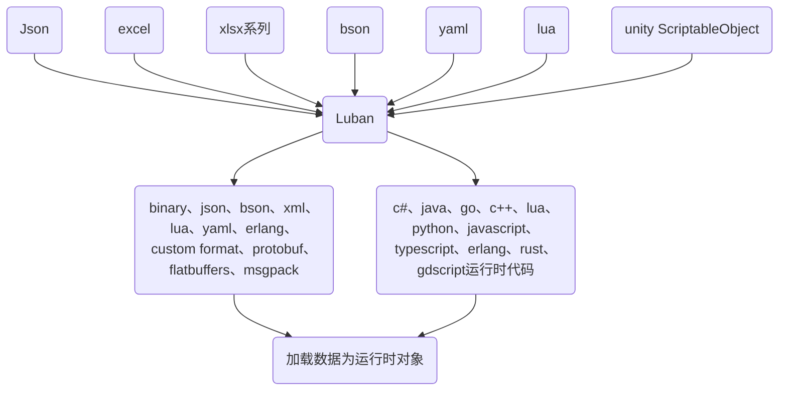

# [Godot4.0] 实用插件搜索计划

godot4.0 rc 版本发布后，新插件如雨后春笋的涌现
很多插件我还没有尝试，但是很多感兴趣的插件，列表如下

## [Panku Console - *A in-game console*](https://github.com/Ark2000/PankuConsole)

**特性如下：**
* 漂亮灵活的多窗口系统
* 简单开箱即用
* 创建窗口实时检测表达式的值
* 绑定表达式到key
* Popup Notification
* 系统debug 信息
* Powerful Inspector Generator（游戏内显示export变量）
* 历史表达式管理

这个真有点猛吧, 很多In-game 的控制台都是侵入式的，需要修改很多游戏代码，但是这个插件利用 `GodotObject` 的 `call(name, params[]) / get(name) / set(name, value)` 方法监控变量，计算表达式，调用方法！


[2023.2.24] 使用情况：设计很方便，主要功能是能在游戏运行时监控对象，但是 godot 本来就有类似的性能监视器功能只是是在编辑器界面的。
对于屏幕小而不能同时到编辑器和游戏窗口的情况很方便。

但是在使用过程中遇到了恶性BUG：
1. 监控的对象一旦被销毁，则会触发空引用报错 。。。
2. 有些时候会出现狂掉帧（原因不明，但是关掉这个插件就恢复了）


## [Softbody 2D - *A squishy shapes generator*](https://github.com/Ughuuu/godot-4-softbody2d)
在 Unity3D 中有很多方法使用软体物理(Juice), 但是 Godot4.0 中仅提供了 3D 软体，而没有2D 软体

虽然可以手动的通过 `Rigidibody2D`， `Spring` 等组件来构造弹性物体，但是 弹簧和钢体之间的连接方式以及数值设置非常令人头疼， 这个插件可以基于 Polygon2D 生成器来生成**多边形轮廓**、**内部顶点**、**骨骼**、**刚体**



## [VP-GAMES's series of plugins](https://github.com/VP-GAMES)

* [Quest Editor(G4)](https://github.com/VP-GAMES/Godot4QuestEditor) : 一个任务编辑器
* [Dialogue Editor(G4)](https://github.com/VP-GAMES/DialogueEditor) : 对话编辑器
* [Inventory Editor (G4) ](https://github.com/VP-GAMES/InventoryEditor): 库存系统
* [Localization Editor (G4)](https://github.com/VP-GAMES/Godot4LocalizationEditor) : 本地化编辑器

这个没了解, 但是看起来不错，之后可以试试 库存和本地化管理器

## [Simple Grass Textured - *A 3D grass editor*](https://github.com/IcterusGames/SimpleGrassTextured)
一个简单的3D草地编辑器，主要功能就是种草，我应该用不上，但是很好奇是怎么实现在草地上种草的(没写过3D 项目)



## [Compute Worker - *A simple compute node*](https://github.com/wardensdev/ComputeWorker)
这是一个比较有趣的东西， 一个支持 GPU 的运算节点，可能哟点类似各个游戏引擎中的 ComputeShader，用于计算大量数据（例如数以千/万计的动画），该节点简化了数据从内存拷贝到缓冲区的过程（大概吧，只看了简介，没用过），想要通过这个项目了解 Godot 的 ComputeShader 如何工作的/

## [Gameplay Attributes](https://github.com/OctoD/godot-gameplay-attributes)
游戏属性是一组用于描述某些节点 使用戈多制作的 2D 和 3D 游戏的角色属性。

## [Controller Icons - *A controller UI*](https://github.com/rsubtil/controller_icons/)
这是一个简单的支持各种控制器的 Controller UI 插件，可以方便的在频幕上显示提示 UI 等
**支持列表**
Xbox 360
Xbox One
Xbox Series
PlayStation 3
PlayStation 4
PlayStation 5
Nintendo Switch Controller
Nintendo Switch Joy-Con
Steam Controller
Steam Deck
Amazon Luna
Google Stadia

## [Godot RL Agents - *A reinforcement learning framework*](https://github.com/edbeeching/godot_rl_agents_plugin)

AI  Agent 插件, 这个好像有点牛逼，一个强化学习框架，提供了很多功能。
**功能如下**
* 提供 在Python 中运行机器学习算法的接口
* 提供三个著名 RL 框架包装器: **StableBaselines3**、**Sample Factory** 和 **Ray RLLib**
* 支持 记忆模型、LSTM、注意力模型
* 支持 2D / 3D 游戏
* 一套 AI 传感器用于增强 Agent 对于游戏世界的感知

## [Smoother - *A physics smoother node*](https://github.com/anatolbogun/godot-smoother-node)

用于平滑运动的节点，即使在真率很低的情况下，也能有等同于屏幕刷新率的效果！

虽然但是，有以下缺点：
1. 适用于刚体，不适用于复杂节点
2. 插值落后真实移动
3. 没有 Look Forward

效果真挺好！

## [Beehave - *A full-featured behaviour tree*](https://github.com/bitbrain/beehave)

这是 [github](www.github.com) 上标星最多的 godot 行为树项目， 相比其他很多行为树插件，该插件看起来文档详细，并且作者自己也在使用并且也会经常更新(比起很多行为树插件bug多，几乎没人维护，这个应该是唯一能用的了)

行为树的树结构是借用了 Godot 的 `SceneTree`, 没有实现基于 `GraphyNode` 的节点编辑器, 但是基本节点和功能都覆盖了。

行为树相关知识可以参考 [Godot Behavior Tree Example](https://github.com/viniciusgerevini/godot-behavior-tree-example)


## [Dialogue Manager - *The bestest dialogue manager*](https://github.com/nathanhoad/godot_dialogue_manager)

这是一个简单的对话管理器插件，功能简单只专注于**对话内容** 和 **对话过程** 的管理（对话过程可以调用方法，类似于godot 动画中调用一样）

**简洁**, 没有多余的 GUI，仅有一个用于编写 .dialogue 文件的编辑器

**高效**, 对话采用**文本编辑**，类似代码中的流程控制，一个 .dialogue 文件甚至可以 import 其他的dialogue，这很符合程序员的想法（hhhh

**独立**, 它是一个完全独立的系统，仅仅提供 `DialogueManager` 的数个 API ，对原本游戏系统几乎"零"侵入。

正因为它足够简单和高效，拓展或者实现自定义 UI 都非常简单！
  


[2023.2.24] 使用情况：很简单易用，暂时没有发现 BUG



几乎把 godot 4.0 的插件列表翻了一遍，对上边这些比较感兴趣，并且打算 **Panku Console** 和 **Beehave** 应用到自己的项目中！

## [GDExcelExporter](https://github.com/kaluluosi/GDExcelExporter)

这是一个导表工具，不知道什么原因并没有集成到 godot-plugin，共工具实现了多个**导出器**
1. GDS1.0
2. GDS2.0
3. RESOURCE
4. JSON1.0
5. JSON2.0

该工具能从 excel 中导入数据表到 gdscript 的类，这样做的原因是 
    
> gdscript 的加载速度比FileAccess加载更快

选择 excel 的原因是 

> Office Excel表格工具本质上讲就是一个轻量级文件数据库，并且作为生产力工具发展这么多年，强大的数据处理能力，支持vbs脚本扩展，非常适合充当数据管理工具

其实使用 excel 也是有弊端的 xlsx 本身是二进制格式对版本管理并不友好

如果是为了使用 excel 的功能可以使用 csv 格式，又不支持多表格文件，也不支持公式等功能

所以有没有一种 **git 友好、人类可读、支持多表格、支持公式、...** 的小型数据库呢？

暂时没找到这样的数据格式，但是找到一个支持 **多语言、多数据格式、代码生成、类型校验** 的导出框架：[Luban](https://gitee.com/focus-creative-games/luban)

## [Luban 导表工具](https://gitee.com/focus-creative-games/luban)

Luban 导表工具主要解决一个问题：
> 游戏中通常会有各种各样的配置文件，json, xml, xlsx, ... 通常游戏项目中会存在多套数据加载方案，这会增加项目的复杂性，降低项目的可维护性

所以 Luban(鲁班)是一个面型多种数据源的导表工具

以上是鲁班的大致的数据流结构，此外luban有以下特性
1. 完备的类型系统，支持OOP类型继承
2. 搭配excel、json、lua、xml等格式数据灵活优雅表达行为树、技能、剧情、副本之类复杂GamePlay数据
3. 强大的数据校验能力。ref引用检查、path资源路径、range范围检查等等（引用检查可以再一个表中引用另一个表，对应代码中对类的引用）
4. 完善的本地化支持。静态文本值本地化、动态文本值本地化、时间本地化、main-patch多地区版本
5. 强大灵活的自定义能力，支持自定义代码模板和数据模板
6. 通用型生成和缓存工具。也可以用于生成协议、数据库之类的代码，甚至可以用作对象缓存服务
7. 良好支持主流引擎、全平台、主流热更新方案、主流前后端框架。支持Unity、Unreal、Cocos2x、Godot、微信小游戏等主流引擎。工具自身跨平台，能在Win,Linux,Mac平台良好工作

主要还是主打一个快！我曾经读过多益的**枪火重生**项目的导表项目，主打的就是一个**慢**，改动一个字段，需要加载 1-5min 不等，非常糟糕！！

luban 框架的性能非常强，非常复杂的项目仅在 1s 内完成，并且使用缓存来优化数据表的生成！

虽然 luban 对 Unity、UE 的支持远大于 Godot（甚至没有编辑器插件。。）

## [phantom-camera](https://github.com/ramokz/phantom-camera)
一个类似 Unity Cinemachine 的相机插件，很好用

并且有文档和教程

## [Improved resource picker](https://github.com/MakovWait/improved_resource_picker)

一个 Resource 选择器，不用像以前那样在很长的列表中选择想要的资源。

## [HyperLog](https://github.com/GuyUnger/HyperLog)

一个 gdscript 的日志插件，本来应该是集成到 语言中的功能，无语。。

## [BulletUpHell](https://github.com/Dark-Peace/BulletUpHell)

一个用于制作弹幕游戏的插件。发射各种形式的字典。

## [godot-ply](https://github.com/jarneson/godot-ply)

一个编辑器内灰盒原型建模工具

## [Godot-DialogPlugin](https://github.com/AnidemDex/Godot-DialogPlugin)
一个对话系统引擎，与 DialogManager 不同，该插件仅提供对话框 UI 实现，所以应该能结合 DialogManager 形成完整的对话引擎。

有丰富的文档和教程。

## [librerama](https://codeberg.org/Librerama/librerama)
一个小游戏集合项目，更新得很勤！！

## [SmartShape2D](https://github.com/SirRamEsq/SmartShape2D)

智能形状

## [gd-YAFSM](https://github.com/imjp94/gd-YAFSM)

一个状态机插件，看起来很好用，如果bug很少的话

## [inspector-gadget](https://github.com/Shfty/inspector-gadget)

检查器 UI 插件

## [godot_2d_global_illumination](https://github.com/samuelbigos/godot_2d_global_illumination)

2D 全局光照

## [material-maker](https://github.com/RodZill4/material-maker)

一个类似 substance 的材质工具，有点牛逼了

## [Godot-Volumetrics-Plugin](https://github.com/SIsilicon/Godot-Volumetrics-Plugin)

体积烟雾

## [gdUnit4](https://github.com/MikeSchulze/gdUnit4)

一个单元测试框架

## [Godot-Trail-System](https://github.com/OBKF/Godot-Trail-System)
trail 插件，用于方便的创建 trail

## [Pixelorama](https://github.com/Orama-Interactive/Pixelorama)
Pixelorama 像素艺术编辑器

## [entity_spell_system](https://github.com/Relintai/entity_spell_system)
实体组件系统，基于c++

## [godot-anl](https://github.com/Xrayez/godot-anl)
c++噪声库，有可视化节点

## [godot-python](https://github.com/touilleMan/godot-python)

godot 调用python，有点牛（基于c++）

## [godot_voxel](https://github.com/Zylann/godot_voxel)
c++ based 将场景体素化（好像是，类似 minecraft）

## [texture_packer](https://github.com/Relintai/texture_packer)
纹理打包

## [voxelman](https://github.com/Relintai/voxelman)
体素引擎

## [imgui-godot](https://github.com/pkdawson/imgui-godot)
ImGUI 插件

## [terrain-tool-godot4](https://github.com/sboron/terrain-tool-godot4)
地形插件
